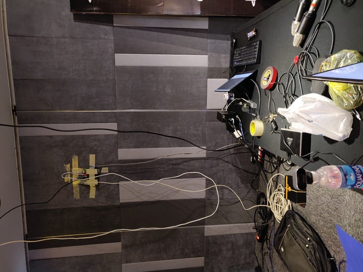
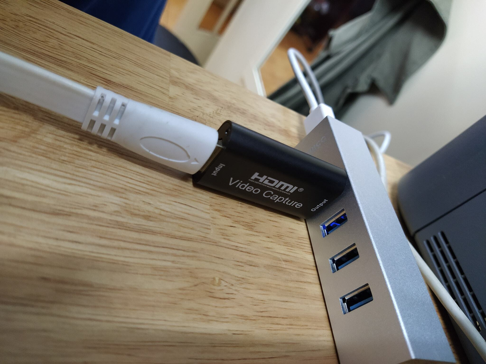
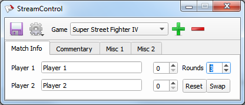
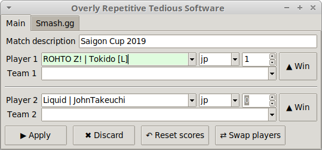

_Khách quan mà nói_, stream cây nhà lá vườn của Saigon Cup từ 2017 tới nay dòm
khá là tử tế:

<iframe width="560" height="315" 
src="https://www.youtube-nocookie.com/embed/tX_Jkz19Qbk" frameborder="0" 
allow="accelerometer; autoplay; encrypted-media; gyroscope; picture-in-picture" 
allowfullscreen></iframe>

Trong bài này mình sẽ giải thích cách Saigon FGC chạy stream, hi vọng sẽ ~~dụ
được đứa khác làm culi cho saigon cup 2021~~ tạo cảm hứng cho nhiều người chạy
stream game đối kháng hơn.

## Phần cứng

Đối với casual streamer, thật ra chỉ cần có 1 PC với card đồ họa rời không quá
cũ là đã đủ để vừa game vừa stream. Mình từng thử stream Tekken 7 ở nhà với 1
con GTX 950, 60fps ổn định.

Tuy nhiên, khi chạy giải bạn sẽ cần máy riêng cho người chơi và người stream,
vì vậy bạn cần thêm thiết bị bắt tín hiệu HDMI (capture device) truyền vô máy
tính qua cổng USB, và cũng cần luôn HDMI splitter để xuất ra cả màn hình cho
người chơi lẫn capture device. SGC gần đây nhất xài:

- Capture device: Elgato HD60 S (mượn của [Kiad Gaming][1])
- Splitter: cái nào cũng được, nghe bảo miễn splitter có dây nguồn riêng thì sẽ
  không lag.

Vụ capture device là vấn đề nhức đầu từ thời mình mới vô: lúc đó hội chỉ có con 
Avermedia được Zhi cho từ thời ~~cổ đại~~ SF4. Cái của nợ đó cực kỳ kén config. 
Mãi tới sau này Kiad chơi lớn, order con Elgato từ Úc về cho hội mượn thì stream 
khỏe hơn hẳn (bây giờ thì VN bán cái này nhan nhản rồi, vẫn mắc nhưng ít ra yên 
tâm hơn tự ship).

Thời gian gần đây xuất hiện một capture device TQ giá cực rẻ: khoảng [$11 trên
aliexpress][2] hoặc [290k trên nshop][3]:

Mình mua từ aliexpress, đã test thử và đúng là nó hỗ trợ tín hiệu 720p60fps
hoặc 1080p30fps ngon lành. Có thể Saigon Cup 2021 sẽ xài con này.

> Saigon Cup trước giờ luôn stream 720p60fps (6000kbps), vì nếu stream fighting
> game ở 30fps nhìn sẽ _rất_ tệ, và mình không tin tưởng đường truyền internet
> ở các nơi tổ chức giải sẽ đủ sức gánh bitrate cho stream 1080p60fps một cách
> ổn định.

Sau khi mua con 720p60 rồi mình mới phát hiện ra nó còn có phiên bản USB 3.0,
[gánh được 1080p60fps][4]! Nếu có ai sẵn sàng chuột bạch thì nhớ chia sẻ kết quả
trên group nhé.

Ngoài ra đã stream giải đấu thì phải có ít nhất 1 camera quay mặt người chơi. 
Nhà giàu sẽ chọn sony handicam, ít giàu hơn nhưng vẫn muốn đẹp thì có thể mượn 
máy DSLR của mấy bạn đang tuổi đam mê nhiếp ảnh, gắn bộ adapter nguồn điện + 
HDMI out + capture device là có thể xuất vô máy PC stream: [tham khảo ở 
đây][7]. Còn nếu nghèo (như SGC) thì có thể mua webcam Logitech C920, hay còn 
gọi là Youtube Influencer Starter Pack.

TODO: microphone + mixer

## Phần mềm

SGC xài OBS để stream, đơn giản vì nó miễn phí và là một trong những 
phần mềm stream phổ biến nhất, nên có hàng tỷ hướng dẫn trên youtube, các bạn 
có thể tự nghiên cứu.

Phần thú vị hơn là bảng điểm, hay còn gọi là scoreboard overlay. Phần 
mềm scoreboard nổi tiếng nhất cho game đối kháng là [StreamControl][5] của 
Farpnut:

Tuy nhiên mình cảm thấy xài chưa thuận tiện lắm nên tự viết [đồ cây nhà lá 
vườn][6]:

Ưu điểm của ORTS so với StreamControl:

- Tự động download thông tin người tham gia giải từ smash.gg - tính năng này 
giúp tiết kiệm khá nhiều thời gian cho SGC '19.
- Tô xanh những ô đã được sửa nhưng chưa apply lên bảng điểm, cho phép undo 
(discard).
- Filter tên thông minh hơn StreamControl.
- Nút bự dễ bấm.

Năm nay nghe phong phanh Smash.gg đòi đổi API nhưng vì SGC '20 bị covid body 
rồi nên mình cũng chả buồn cập nhật. Chắc đầu năm 21.

[1]: https://www.facebook.com/KIADGaming/
[2]: https://www.aliexpress.com/item/4000917130635.html
[3]: https://www.nshop.com.vn/products/capture-card-usb-choi-game-ps4-nintendo-switch-tren-laptop
[4]: https://ae01.alicdn.com/kf/H48296ff7ce8949708f95d3f191c4dc57b/Rullz-4K-Video-Capture-Card-USB-3-0-2-0-HDMI-Video-Grabber-Record-Box-for.jpg
[5]: https://farpnut.net/streamcontrol/
[6]: https://github.com/nhanb/orts/
[7]: https://www.youtube.com/watch?v=E8TvG3a5XJY
